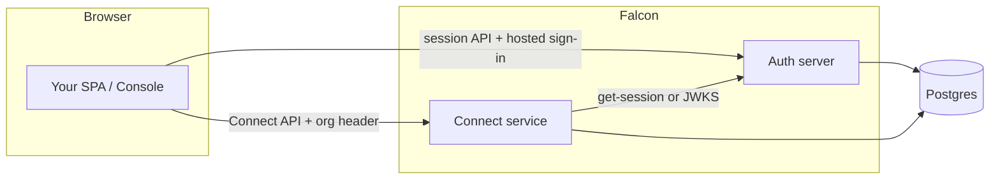

# Architecture

This page describes how Falcon’s pieces fit together at runtime. Exact hostnames and ports depend on your environment; local development often uses separate ports for each service.

## Logical components

### Auth server

- Serves **Better Auth** routes (for example `/api/auth/sign-in/email`, `/api/auth/get-session`, organization APIs used by the console).
- Serves **hosted** HTML flows at `/hosted/sign-in` and `/hosted/sign-up` for centralized sign-in (see [Centralized sign-in](../falcon-auth/centralized-sign-in.md)).
- Applies **dynamic CORS**: the console origin is always allowed; other origins may be allowed when a valid **`X-Falcon-App-Id`** (publishable key) matches a registered app whose **`allowed_origins`** includes the request `Origin`.
- Exposes **user app directory** routes (for example listing apps the user has used) for the console.

### Connect service

- Serves the **Falcon Connect HTTP API** (for example `/v1/apps`, `/v1/installation-requests`, `/v1/connections`).
- **Does not** implement its own username/password login. Instead it establishes **who** is calling by:
  - Forwarding **cookies** to the auth server’s `get-session`, or
  - Validating a **Bearer JWT** against the auth server’s JWKS.
- Requires an **`X-Organization-Id`** header on requests so every operation is scoped to one organization and membership can be checked.

### Console

- A SPA that uses the **same auth server** as your apps (no separate “console-only” identity product in the default setup).
- Uses Better Auth’s **organization** plugin for creating orgs, switching active org, and membership.
- When Connect is configured, uses the Connect API with the user’s session cookies and the **active organization** id.

### Your applications

- Browser apps load the SDK, configure `serverUrl` and `publishableKey`, and either redirect to **hosted** sign-in or use optional **embedded** SDK forms.
- Server apps can verify sessions with [`verifySession`](../sdk/server-verification.md).

## Data storage

A single **PostgreSQL** database typically holds:

- **Auth tables** (Better Auth: users, sessions, accounts, verification, organization plugin tables).
- **`falcon_auth_app`** — registered Auth clients (origins, redirect URLs, publishable key).
- **`app_user`** — links users to Auth apps they have used.
- **Connect tables** — `falcon_app`, `app_capability`, `installation_request`, `connection`, `connection_scope`, settings, audit, and related rows.

The auth server and connect service are configured with database access to these schemas.

## Request flows (high level)

### Sign-in (centralized)

1. User opens your app; your app redirects to `https://your-auth-server/hosted/sign-in?client_id=…&redirect_uri=…`.
2. User submits credentials on the auth origin; the auth server sets a **session cookie** for its domain.
3. Browser navigates to `redirect_uri` on your app’s origin.
4. Your app’s SDK calls `get-session` on the auth server with `credentials: 'include'` so the cookie is sent; the user appears signed in.

Details: [Centralized sign-in](../falcon-auth/centralized-sign-in.md).

### Connect: create installation request

1. Authenticated user (session cookie or JWT) calls `POST /v1/installation-requests` with **`X-Organization-Id`** set.
2. Connect resolves the principal (user id + org id + **role** from membership).
3. If the role may create requests, a row is created in **`installation_request`** with status `pending`.

### Connect: approve and form a connection

1. A user with **owner** or **admin** role on the same organization (typically on the **target** side in product flows) calls `POST /v1/installation-requests/:id/approve`.
2. Connect creates a **connection** and records granted **scopes**.

Details: [Installation requests and approval](../falcon-connect/installation-and-approval.md).

## Security notes (operator view)

- **Allowed origins** for each Auth app limit which websites may call the auth API with that publishable key.
- **Redirect URLs** for hosted sign-in are an **exact-match** allow list to prevent open redirects.
- Connect requires **explicit organization** on every call to avoid ambiguous tenancy.
- **Roles** gate create vs approve vs revoke/pause operations; see [Permissions matrix](../reference/permissions-matrix.md).

## Related reading

- [Environment variables](../reference/environment-variables.md)
- [Calling the Connect API](../falcon-connect/authentication.md)
